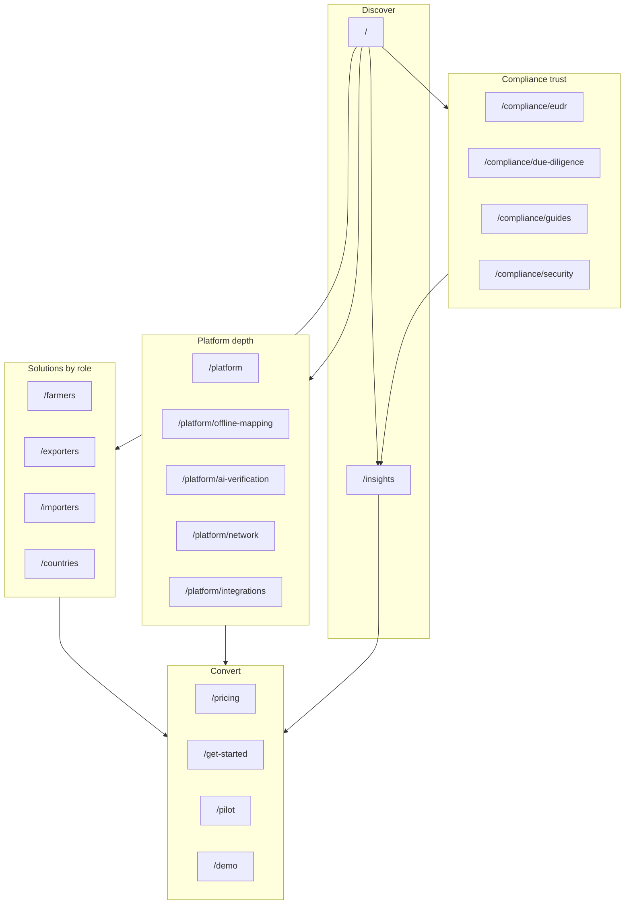

# Marketing Site Architecture & Rollout Plan

**Status:** Planning — stealth build, then public launch  
**Last updated:** 2026-06-08 (June 2026 definition integrated)  
**Owner:** Marketing / product  
**Package:** `apps/marketing`

This document is the working blueprint for restructuring the Tracebud marketing website so visitors can find what they need, trust Tracebud for EUDR traceability, and feel excited about what the platform makes possible.

## Build order (agreed workflow)

We build **in secret first**, then **go public in one assembly step**:

| Stage | What happens | Public visitors see |
| --- | --- | --- |
| **A — Stealth build** | All new pages, sections, and Insights content at final URLs; reviewed locally / via preview link | Current site only (unchanged nav & homepage) |
| **B — Launch assembly** | Flip publication flags, wire nav + footer, mount homepage sections, expand sitemap | Full new IA live |

Do **not** wire new routes into header, footer, homepage, or sitemap until Stage B unless explicitly previewing.

## Related docs

| Doc | Purpose |
| --- | --- |
| [REQUIREMENTS.md](./REQUIREMENTS.md) | Marketing scope and canonical PRD links |
| [BRAND_GUIDELINES.md](./BRAND_GUIDELINES.md) | Voice, tone, colors, intended nav pattern |
| [README.md](./README.md) | Dev setup, lead forms, analytics |
| [../../REQUIREMENTS.md](../../REQUIREMENTS.md) | Strategic positioning (EUDR, sovereignty, network) |
| [../../MVP_PRD.md](../../MVP_PRD.md) | Release boundary for v1 messaging |
| [../../TRACEBUD_DEFINITION_JUNE_2026.md](../../TRACEBUD_DEFINITION_JUNE_2026.md) | **Canonical** product definition + target website IA (June 2026) |
| [lib/marketing-route-migration.ts](./lib/marketing-route-migration.ts) | Current stealth URL → definition target URL map |

---

## June 2026 definition — target IA

Founder definition (June 2026) reframes Tracebud as a **farmer-first agrifood OS** with **Field App + Dashboard** core and a **modular solutions marketplace**. Marketing outcomes replace a separate “impact product” SKU.

### Target top-level navigation (Stage B+)

```
Logo    Solutions ▾    Platform ▾    Who we serve ▾    Outcomes ▾    Resources ▾    Pricing    [CTA]
```

### Target sitemap (canonical)

See full tree in [TRACEBUD_DEFINITION_JUNE_2026.md](../../TRACEBUD_DEFINITION_JUNE_2026.md). Key groups:

| Group | Target hub | MVP / stealth status |
| --- | --- | --- |
| Platform | `/platform/field-app`, `/platform/dashboard` | Draft pages live; legacy `/platform/offline-mapping` etc. until merge |
| Solutions | `/solutions/*` (6 modules) | Draft hub + pages gated; EUDR = start here |
| Who we serve | `/who-we-serve/*` | Hub draft; persona pages stay at `/farmers`, `/exporters`, … until rename |
| Outcomes | `/outcomes/*` (3 pillars) | v0 styles `/impact/*` on branch `v0/stlaurentraph-4260-3ace7b2a`; rename at launch |
| Resources | `/resources/*` | Draft hub; `/insights` → `/resources/insights` at launch |

### Migration strategy (do not block v0)

1. **Now:** Definition in repo docs; stealth draft routes at **target URLs** (`/solutions`, `/who-we-serve`, `/resources`, `/platform/field-app`).
2. **v0 pass:** Continue styling **current** URLs on `v0/stlaurentraph-4260-3ace7b2a` (impact, compliance, personas).
3. **Stage B:** Flip publication flags; wire nav; add **301 redirects** per `marketing-route-migration.ts` (`/impact` → `/outcomes`, `/farmers` → `/who-we-serve/producers-cooperatives`, etc.).

### v0 branch coordination

Active styling: `https://github.com/stlaurentraph-ux/tradebud.com/tree/v0/stlaurentraph-4260-3ace7b2a`  
Do **not** restyle finished persona/pricing pages. New definition routes appear under **June 2026 definition** on `/en/draft`.

---

## Goals

1. **Discoverability** — Rich pages (personas, pricing, platform depth) are reachable from nav and footer, not only homepage anchors.
2. **Trust** — Compliance and regulatory content is structured, current, and auditable (deadlines, workflows, security).
3. **Excitement** — “What’s possible” narrative shows whole-chain network effects, not just checkbox compliance.
4. **Conversion** — Every page has a role-aware next step (app download, trial, pilot, waitlist).
5. **SEO & thought leadership** — **Insights** (blog) hub with categorized, linkable content.

---

## Current state (baseline)

### What exists today

| Route | Status | Notes |
| --- | --- | --- |
| `/[locale]/` | Live | Long-scroll homepage: hero, problem, how-it-works, products, value prop, FAQ |
| `/[locale]/farmers` | Live | Persona + lead form |
| `/[locale]/exporters` | Live | Persona + lead form |
| `/[locale]/importers` | Live | Persona + lead form |
| `/[locale]/countries` | Live | Persona + lead form |
| `/[locale]/pricing` | Live | Tier model |
| `/[locale]/get-started` | Live | Role picker → dashboard / app stores |
| `/[locale]/pilot` | Live | Pilot application |
| `/[locale]/demo` | Live | Under-linked from main nav |
| `/[locale]/privacy`, `/terms` | Live | Legal |
| `/[locale]/thank-you` | Live | Post-conversion |

### Gaps to close

- Header nav uses **homepage anchors only** (`#why-tracebud`, `#how-it-works`, `#products`, `#faq`) — persona and pricing pages are hidden.
- Brand guidelines specify **Solutions · Technology · Compliance · Partners** nav — not implemented.
- `app/sitemap.ts` omits persona, pricing, get-started, pilot, and future insights routes.
- No **Insights / blog** layer.
- Duplicate non-locale routes (`/farmers` vs `/[locale]/farmers`) — consolidate or redirect over time.
- `/demo` and `/demo-ecosystem` are underused conversion assets.

---

## Visitor intents

Every public page should answer one primary intent within ~10 seconds.

| Intent | Visitor question | Primary destinations |
| --- | --- | --- |
| **Choose** | “Is Tracebud for me?” | Solutions (by role) |
| **Understand** | “How does it work?” | Platform, How it works |
| **Trust** | “Can I rely on this for EUDR?” | Compliance hub, Insights |
| **Act** | “What do I do next?” | Get started, Pricing, Pilot |

---

## Target information architecture

### Top-level navigation

```
Logo    Solutions ▾    Platform    Compliance    Pricing    Insights    [Primary CTA →]
```

| Item | Type | Destination (v1) |
| --- | --- | --- |
| **Solutions** | Mega-menu | Persona pages (see below) |
| **Platform** | Link → hub | `/[locale]/platform` (phase 2) |
| **Compliance** | Link → hub | `/[locale]/compliance` (phase 3) |
| **Pricing** | Link | `/[locale]/pricing` |
| **Insights** | Link | `/[locale]/insights` (phase 1) |
| **Primary CTA** | Button | Role-aware (see CTA strategy) |

### Solutions mega-menu

**By role**

| Label | Route | Outcome message |
| --- | --- | --- |
| Farmers & producers | `/farmers` | Map plots and build a compliance passport |
| Cooperatives | `/farmers` or `/cooperatives` (new) | Roll up member evidence at scale |
| Exporters | `/exporters` | Batch DDS prep and due diligence |
| Importers & brands | `/importers` | Supplier visibility and audit readiness |
| Governments | `/countries` | National traceability infrastructure |

**By outcome** (phase 2+ — can live in mega-menu second column)

| Outcome | Future route |
| --- | --- |
| Plot mapping & GeoID | `/platform/offline-mapping` |
| EUDR due diligence | `/compliance/due-diligence` |
| Batch traceability | `/exporters` (anchor or section) |
| Supplier outreach | `/importers` (anchor or section) |

### Site map (target)



---

## Homepage structure (evolve existing scroll)

Keep the long-scroll pattern; add funnel sections. Order:

1. **Hero** — tagline, dual CTA (existing)
2. **Social proof strip** — pilot cohort, countries, plots mapped (phase 2; placeholder OK initially)
3. **Choose your path** — 5 persona cards linking to `/farmers`, `/exporters`, `/importers`, `/countries`, cooperative path (phase 1)
4. **The problem** — existing `HomeProblemSection`
5. **How it works** — existing `HomeHowItWorks`
6. **What’s possible** — network vision: any node starts workflows; farmer sovereignty; identity-preserved batches (phase 2; reuse `chain-flow` / `process-flow`)
7. **Platform snapshot** — existing `Products` section
8. **Why Tracebud** — five differentiators vs closed ecosystems / spreadsheets (phase 2)
9. **Latest insights** — 3 recent posts from `/insights` (phase 1)
10. **FAQ** — existing
11. **Footer CTA** — waitlist (existing)

---

## Insights (blog) specification

**Public name:** Insights (not “Blog”) — better fit for B2B and regulatory audiences.

**Base route:** `/[locale]/insights`

### Content pillars

| Pillar | Slug | Purpose | Example topics |
| --- | --- | --- | --- |
| Regulation & EUDR | `regulation` | SEO, urgency | Simplified declarations, deadlines, commodity matrix |
| Field notes | `field-notes` | Emotional connection | Farmer/co-op stories, offline mapping in the field |
| Technology | `technology` | Differentiation | Waypoint averaging, GFMs, photo vault |
| Playbooks | `playbooks` | Lead gen | 90-day exporter checklist, importer audit prep |
| Product updates | `product` | Excitement for leads | Feature launches, pilot milestones |
| Comparisons | `compare` | Choice framing | Spreadsheets vs IP batches; open network vs lock-in |

### URL patterns

```
/insights                              Hub (featured, categories, newsletter)
/insights/[slug]                         Article
/insights/category/[category]            Category archive
/insights/tag/[tag]                      Tag archive (optional v2)
/insights/author/[slug]                  Author page (optional v2)
```

### Technical approach (recommended)

- **Phase 1:** MDX or markdown in `apps/marketing/content/insights/`
- Frontmatter fields: `title`, `description`, `category`, `tags[]`, `locale`, `publishedAt`, `updatedAt`, `author`, `heroImage`, `draft`
- Static generation via Next.js App Router (`generateStaticParams` per locale + slug)
- **Phase 2+:** Headless CMS (Sanity, Contentful) if non-engineers publish weekly

### Seed content (launch minimum)

Publish at least three articles before announcing Insights:

1. **Regulation** — EUDR simplified declarations: who qualifies and what to capture
2. **Technology** — Why offline-first mapping matters under tropical canopy
3. **Playbook** — Exporter’s EUDR readiness checklist (link to `/pilot` CTA)

### Per-article CTA rules

| Article type | Default CTA |
| --- | --- |
| Regulation | “Check your readiness” → `/get-started` |
| Field notes | “Download the app” → app store links |
| Playbooks | “Apply for pilot” → `/pilot` |
| Product | “Start free trial” → dashboard signup |
| Technology | “See how it works” → `/demo` or `#how-it-works` |

### i18n

- Posts carry a `locale` field; only show in matching locale hub unless `fallbackLocale: en` is set.
- Untranslated posts: show English with banner “Available in English only”.
- Align with existing locales in `i18n.config` and `messages/*.json`.

---

## Platform section (phase 2)

Hub: `/[locale]/platform` — largely repackage existing `#products` and product copy.

| Page | Route | Key messages |
| --- | --- | --- |
| Overview | `/platform` | Mobile app + dashboard, one capture many markets |
| Offline mapping | `/platform/offline-mapping` | No signal, waypoint averaging, manual trace fallback |
| AI verification | `/platform/ai-verification` | GFM batch jobs, photo vault overrides false positives |
| Network & sovereignty | `/platform/network` | Request-grant, farmer data wallet, no vendor lock-in |
| Integrations | `/platform/integrations` | TRACES NT, national registries, ESG connectors (roadmap labels OK) |

Reuse components: `products.tsx`, `chain-flow.tsx`, `process-flow.tsx`, `verticals.tsx`.

---

## Compliance section (phase 3)

Hub: `/[locale]/compliance`

| Page | Route | Key messages |
| --- | --- | --- |
| EUDR hub | `/compliance/eudr` | Deadlines (2026-12-30 / 2027-06-30), commodities, simplified declarations |
| Due diligence flow | `/compliance/due-diligence` | Plot → verify → batch → DDS → TRACES |
| Guides | `/compliance/guides` | Downloadable checklists (lead magnets) |
| Security & audit | `/compliance/security` | 5-year retention, tenant isolation, RBAC, GDPR posture |

Use **Mountain Clay** deadline badges per brand guidelines. Copy must match [REQUIREMENTS.md](../../REQUIREMENTS.md) — no overclaiming MVP features.

---

## Positioning: five differentiators

Repeat across homepage, persona pages, and Insights. Tracebud wins on infrastructure, not checkbox UX.

| # | Differentiator | Message | Primary surfaces |
| --- | --- | --- | --- |
| 1 | Capture once | One map, reused across every market | Hero, farmers |
| 2 | Works offline | Built for real fields, not office Wi‑Fi | Platform, field notes |
| 3 | Farmer sovereignty | Farmers own their data wallet / GeoID | Network page, vs lock-in |
| 4 | Identity preservation | No mass-balance laundering; IP batches | Exporters, compliance |
| 5 | Whole-chain network | Any node can start a workflow | Homepage “what’s possible” |

**“Why Tracebud” page (optional phase 3):** `/[locale]/why-tracebud` — principles comparison (open network, offline-first, IP batches, farmer-owned GeoID) without naming competitors.

---

## Navigation UX

### Role-aware primary CTA (header)

| Context | CTA label | Action |
| --- | --- | --- |
| Default / insights | Join waitlist / Start trial | Waitlist dialog or `/get-started` |
| `/farmers` | Download app | App store links |
| `/exporters`, `/importers` | Start free trial | Dashboard signup with `?role=` |
| `/countries` | Contact us / Pilot | `/pilot` or `mailto:hello@tracebud.com` |
| `/pricing` | Get started | `/get-started` |

### Persona page journey strip

Add a consistent mini-journey on each solutions page:

`Capture → Verify → Package → Submit → Audit-ready`

Helps visitors see progress toward their outcome.

### Footer (grouped sitemap)

Replace flat hash links with grouped columns:

```
Solutions          Platform           Compliance         Company
─────────          ────────           ──────────         ───────
Farmers            Overview           EUDR hub           About (future)
Exporters          Offline mapping    Guides             Insights
Importers          AI verification    Security           Contact
Countries          Integrations       Privacy
Cooperatives       Network            Terms
Pricing
Get started
Pilot
```

Keep waitlist CTA band above footer (existing pattern).

### Internal linking rules

Each persona page should link to:

- 1 platform page (or homepage `#products` until platform hub ships)
- 1 compliance resource (or Insights article)
- 1 Insights post (when available)
- 1 conversion page (`/get-started`, `/pilot`, or app stores)

---

## CTA & conversion map

| Page | Primary CTA | Secondary CTA |
| --- | --- | --- |
| Home | See how it works | Join waitlist |
| Persona pages | Role-specific (above) | Book demo → `/demo` |
| Pricing | Get started | Contact for enterprise |
| Insights article | Contextual (table above) | Newsletter / waitlist |
| Platform | Start trial / Download app | Demo |
| Compliance | Download guide | Pilot |

Existing lead APIs unchanged: `POST /api/waitlist`, `POST /api/leads` per [README.md](./README.md).

---

## SEO & discoverability

### Sitemap (`app/sitemap.ts`)

Include all public locale routes:

- Home, persona pages, pricing, get-started, pilot, demo, insights (+ each article slug), platform, compliance, privacy, terms, thank-you.

### Metadata

- Per-page `title` / `description` aligned with persona and pillar keywords (EUDR, traceability, coffee, cocoa, etc.).
- Insights: `article` Open Graph, `publishedTime`, canonical URL per locale.
- Reuse `/og-image.png` or per-article OG images (future).

### Structured data (phase 2)

- `Organization` on layout
- `Article` on insights posts
- `FAQPage` on homepage FAQ section

---

## Analytics events (extend existing)

Already tracked per README: `marketing_waitlist_*`, `marketing_lead_submitted`, `marketing_thank_you_viewed`.

Add when nav / insights ship:

| Event | When |
| --- | --- |
| `marketing_nav_solutions_opened` | Solutions mega-menu opened |
| `marketing_nav_link_clicked` | Nav link with `destination` property |
| `marketing_persona_card_clicked` | Homepage choose-your-path card |
| `marketing_insights_article_viewed` | Article page view with `slug`, `category` |
| `marketing_insights_cta_clicked` | In-article CTA with `cta_type` |
| `marketing_demo_opened` | Demo page entry from CTA |

---

## Stealth build & launch (technical model)

New work stays **reachable for us** but **invisible to the public** until launch.

### Publication registry

Central file: `lib/marketing-publication.ts`

```ts
export type MarketingRouteId =
  | 'insights'
  | 'insights-article'
  | 'platform'
  | 'platform-offline-mapping'
  | 'platform-ai-verification'
  | 'platform-network'
  | 'platform-integrations'
  | 'compliance'
  | 'compliance-eudr'
  | 'compliance-due-diligence'
  | 'compliance-guides'
  | 'compliance-security'
  | 'cooperatives'
  | 'why-tracebud'
  | 'home-v2'; // homepage sections bundle

export const marketingRoutePublication: Record<MarketingRouteId, boolean> = {
  insights: false,
  // ... all false until Stage B
};

export function isMarketingRoutePublished(id: MarketingRouteId): boolean {
  if (process.env.NODE_ENV === 'development') return true; // always preview locally
  if (process.env.MARKETING_PREVIEW_SECRET && hasValidPreviewCookie()) return true;
  return marketingRoutePublication[id];
}
```

Each new page layout calls `assertRoutePublished('platform')` → **404 in production** when `false`.

### Preview for stakeholders (optional)

- Env: `MARKETING_PREVIEW_SECRET=<random>`
- URL: `?marketing_preview=<secret>` sets an httpOnly cookie (middleware)
- Lets you share draft pages on a deployed preview without exposing them in nav or sitemap

### What stays hidden during Stage A

| Surface | Stage A behavior |
| --- | --- |
| Header / footer nav | Unchanged — no links to unpublished routes |
| Homepage | Unchanged — new sections live only as unmounted components or `/[locale]/preview` |
| `sitemap.ts` | Only currently public routes |
| `robots` / metadata | `noindex` on any accidentally reachable draft route |
| Internal links on draft pages | OK between draft pages (for review); no links from live pages |

### Homepage during stealth

Two options (pick one when we start):

1. **Component stash (recommended)** — build `components/tracebud/home-v2/*`; do not import on live `[locale]/page.tsx` until launch.
2. **Preview route** — `/[locale]/preview` renders the full future homepage for side-by-side review.

### Launch flip (Stage B — single assembly PR)

One coordinated change set:

1. Set all `marketingRoutePublication` entries to `true` (or remove guards).
2. Ship `SiteNav` + grouped footer with full link map.
3. Mount home-v2 sections on live homepage (or replace page).
4. Expand `sitemap.ts` + submit to Search Console.
5. Enable nav/footer analytics events.
6. Remove or redirect duplicate non-locale routes.

---

## Implementation phases

### Stage A — Stealth build (pages & content only)

Build at **final URLs**, gated by publication registry. No nav/sitemap/homepage wiring.

#### A1 — Infrastructure

- [x] `lib/marketing-publication.ts` + `assertRoutePublished()` helper
- [x] Preview cookie middleware (optional `MARKETING_PREVIEW_SECRET`)
- [x] `lib/insights.ts` + `content/insights/` markdown loader
- [x] Shared page shells: `MarketingPageLayout`, draft banner in dev
- [x] i18n strings for future nav (can land early; unused until Stage B)
- [x] `/[locale]/insights` hub + `[slug]` article routes (gated)
- [x] `/[locale]/preview` placeholder for homepage assembly
- [x] 3 seed insight articles in `content/insights/`

#### A2 — Insights (all content)

- [x] `/[locale]/insights` hub
- [x] `/[locale]/insights/[slug]` article template
- [x] Seed articles (6 published; v0 can style article layout):
  - [x] EUDR simplified declarations
  - [x] Offline mapping under canopy
  - [x] Exporter EUDR checklist
  - [x] Identity preservation vs mass balance
  - [x] Farmer data wallet / sovereignty
  - [x] TRACES NT workflow overview

#### A3 — Platform section

- [x] `/[locale]/platform` hub
- [x] `/[locale]/platform/offline-mapping`
- [x] `/[locale]/platform/ai-verification`
- [x] `/[locale]/platform/network`
- [x] `/[locale]/platform/integrations`

#### A4 — Compliance section

- [x] `/[locale]/compliance` hub
- [x] `/[locale]/compliance/eudr`
- [x] `/[locale]/compliance/due-diligence`
- [x] `/[locale]/compliance/guides`
- [x] `/[locale]/compliance/security`

#### A5 — Solutions & positioning pages

- [x] `/[locale]/cooperatives`
- [x] `/[locale]/sponsors`
- [x] `/[locale]/why-tracebud`
- [ ] Refresh existing persona pages (internal cross-links — defer to v0 pass)

#### A6 — Homepage v2 (components only)

- [x] `ChooseYourPath` persona cards
- [x] `WhatsPossible` network section
- [x] `WhyTracebud` differentiators
- [x] `SocialProofStrip`
- [x] `LatestInsights` teaser
- [x] Preview assembly at `/[locale]/preview`
- [x] `/[locale]/draft` internal index of all unpublished routes

**Stage A acceptance criteria**

- Every new route returns 200 locally and **404 in production** (unless preview secret).
- Live site nav, footer, homepage, and sitemap are **unchanged**.
- Draft pages link to each other for coherent review flows.
- Copy passes compliance guardrails (deadlines, tier pricing, no overclaiming).

---

### Stage B — Public launch (assembly only)

No new pages — wire what exists into the live site.

- [ ] Flip `marketingRoutePublication` → all `true`
- [ ] Replace header with `SiteNav` (Solutions mega-menu, Platform, Compliance, Pricing, Insights)
- [ ] Replace footer with grouped sitemap
- [ ] Mount homepage v2 sections on `/[locale]/`
- [ ] Role-aware header CTA
- [ ] Expand `sitemap.ts` (all routes + insight slugs)
- [ ] `noindex` removed; OG metadata verified per page
- [ ] Nav analytics events enabled
- [ ] 301 non-locale duplicate routes → `/[locale]/...`
- [ ] Smoke test: every link in nav ≤2 clicks deep; mobile menu OK

**Stage B acceptance criteria**

- Public site matches target IA diagram in this doc.
- Search Console sitemap accepted.
- No unpublished 404s linked from nav/footer/homepage.

---

### Stage C — Post-launch polish (optional, after go-live)

- [ ] Newsletter on Insights hub
- [ ] Author / tag archives
- [ ] Per-article OG images (`scripts/generate-og-image.py`)
- [ ] FAQ `FAQPage` structured data
- [ ] Customer stories / logos when assets exist
- [ ] Headless CMS if publish velocity warrants it

---

## Engineering notes

### Suggested file layout (Stage A)

```
apps/marketing/
  SITE_ARCHITECTURE.md
  content/insights/               ← MDX articles (draft until launch)
  lib/
    marketing-publication.ts      ← route publish flags + assert helper
    insights.ts
  components/
    site-nav.tsx                  ← built in Stage A; wired in Stage B only
    tracebud/home-v2/             ← homepage sections (unmounted until Stage B)
    insights/
  app/[locale]/
    insights/...
    platform/...
    compliance/...
    cooperatives/...
    why-tracebud/...
    preview/page.tsx              ← optional full homepage preview
```

### Header migration (Stage B only)

- **Stage A:** keep `components/tracebud/header.tsx` on all live pages; build `site-nav.tsx` in parallel (use on `/preview` or draft layouts for review).
- **Stage B:** swap import `Header` → `SiteNav` across layouts; preserve homepage scroll anchor behavior where needed.

### Working with the agent (suggested session order)

1. A1 infrastructure (publication gate + insights loader)
2. A2 Insights hub + articles
3. A3 Platform pages
4. A4 Compliance pages
5. A5 Cooperatives + why-tracebud + persona refresh
6. A6 Homepage v2 components + `/preview`
7. Review pass on preview URLs
8. **B** Launch assembly PR

### Quality gates (per slice)

When implementing each phase, verify:

- [ ] Permissions — N/A for public marketing; no tenant data leaked in examples
- [ ] Analytics — events listed above for new interactions
- [ ] i18n — new strings in locale files; Insights locale filtering
- [ ] Acceptance criteria — phase checkboxes satisfied
- [ ] Exception handling — 404 for missing slugs; draft posts excluded from production build

---

## Copy & compliance guardrails

- EUDR deadlines: **2026-12-30** (large/medium), **2027-06-30** (micro/small) — per root REQUIREMENTS.
- Do not promise features outside MVP_PRD without “roadmap” or “pilot” labeling.
- Farmer-free tier and exporter/importer pricing must match `/pricing` and root REQUIREMENTS tier model.
- TRACES NT integration: describe as middleware translation to SOAP/XML — accurate, not “one-click API”.
- Use **Insights** for regulatory content; legal review before publishing declaration advice.

---

## Open decisions

| Decision | Options | Recommendation |
| --- | --- | --- |
| Blog public name | Insights vs Blog vs Resources | **Insights** |
| Cooperatives URL | `/farmers` section vs `/cooperatives` | Dedicated `/cooperatives` when copy diverges |
| Insights CMS | MDX in repo vs headless CMS | MDX for phase 1 |
| Primary CTA default | Waitlist vs Start trial | Waitlist until GA; trial for exporter/importer contexts |
| Non-locale routes | 301 to `/en/...` vs remove | 301 at Stage B |
| Stealth mechanism | Route prefix vs publication registry | **Publication registry** at final URLs |
| Homepage preview | `/preview` route vs unmounted components | **Both** — components + optional `/preview` |

---

## Changelog

| Date | Change |
| --- | --- |
| 2026-06-08 | Initial architecture and phased rollout plan |
| 2026-06-08 | Reordered workflow: Stage A stealth build → Stage B public assembly |
