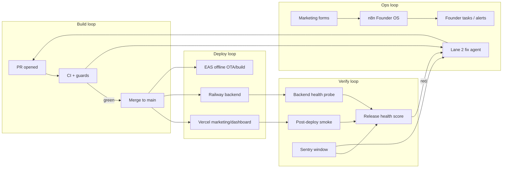

# Automation & agent operations plan (exhaustive)

Last updated: 2026-06-21  
Status: **Rolling out — Phase 4 complete; Phase 5 parked**  
Canonical ADR: `product-os/05-decisions/ADR-007-agent-automation-ops.md`  
Work intake: `product-os/06-status/agent-queue.md`  
Cursor: `.cursor/rules/agent-operations.mdc`  
Commands: `implement-automation-slice`, `fix-regression`, `build-feature`, `start-agent-task`, `session-close`

---

## 1. Purpose

This plan defines how Tracebud runs **monitoring**, **maintenance**, and **feature development** in parallel — mostly via Cursor / Cloud Agents — without the founder manually verifying builds, staging, or routine regressions.

**North star:** four automated loops (build → deploy → verify → ops) with human approval only on prioritization, sensitive compliance surfaces, and production promote until release health is trusted.

---

## 2. Goals & success metrics

| Goal | Success signal | Target phase |
|------|----------------|--------------|
| No manual “does it build?” | PR proves lint + typecheck + tests + build per app | Phase 0 |
| No manual “did staging break?” | Post-deploy smoke + Sentry alerts → fix PR | Phase 2–3 |
| Safe parallel agents | One writer per app; worktrees / Cloud Agents | Phase 0 (process) |
| Closed regression loops | Prod/staging error → fix PR → guardrail test | Phase 2–4 |
| Fast CI for parallel agents | Affected-only jobs + remote cache | Phase 1 |
| No silent API/schema drift | OpenAPI parity + migration drift CI | Phase 1–4 |
| Ops without dashboard babysitting | n8n Founder OS + form/smoke automation | Phase 2–3 |
| >80% PRs ship without manual staging click-through | Playwright + release health gate | Phase 4 |

| Metric | Target |
|--------|--------|
| Dashboard CI wall time | <8 min (Phase 1) |
| Agent first-pass CI green | >70% (Phase 3 hooks) |
| Sentry staging → fix PR | <24 h (Phase 3 automations) |
| PRs without manual staging check | >80% (Phase 4) |

---

## 3. Operating model

### 3.1 Four planes

| Plane | Artifacts | Role |
|-------|-----------|------|
| **Control** | `agent-queue.md`, `current-focus.md`, FEAT docs, ADR-007 | Intake, prioritization, collision avoidance |
| **Execution** | Branches, worktrees, Cursor commands | Agents implement slices |
| **Verification** | GitHub Actions, guard scripts, Playwright, Maestro | Prove correctness before/after merge |
| **Observation** | Sentry, Vercel Analytics, smoke probes, n8n, Supabase advisors | Detect runtime / ops failures |

### 3.2 Four loops (not three lanes)



| Loop | Trigger | Automation owner | Human |
|------|---------|------------------|-------|
| **Build** | PR / push | CI jobs + guard scripts | Merge approval (sensitive) |
| **Deploy** | Merge to `main` | Vercel / Railway / EAS | Prod promote until RH trusted |
| **Verify** | Deploy success + cron | Smoke workflows, Playwright, Sentry release health | Escalation on red RH |
| **Ops** | Forms, schedules, alerts | n8n Founder OS, Cursor Automations | Outreach execution (LinkedIn manual) |

### 3.3 Three lanes (execution — never mix in one PR)

| Lane | Purpose | Branch prefix | Cursor command | PR tag |
|------|---------|---------------|----------------|--------|
| **1 Guardrails** | CI, hooks, guards, contract tests, docs | `chore/automation-*` | `implement-automation-slice` | `[guardrails]` |
| **2 Maintenance** | Regressions from Sentry / CI / smoke | `fix/*` | `fix-regression` | `[fix]` |
| **3 Features** | Product slices from FEAT docs | `feature/<app>-*` | `start-agent-task` → `build-feature` | `[app]` |

### 3.4 Parallelism rules

- **One active writer per app directory:** `apps/marketing`, `apps/dashboard-product`, `apps/offline-product`, `tracebud-backend`, `apps/field-auth`.
- **Different apps may run in parallel** (e.g. marketing guardrails + dashboard feature + offline fix).
- **Same app:** serialize or use **git worktrees** — one branch per worktree, one Cloud Agent session each.
- **Lane 1 vs Lane 3 on same app:** feature work waits if a guardrails PR is open for that app tree.
- **Lane 2** may run on app A while Lane 3 runs on app B; Lane 2 on same app as Lane 3 only if scopes do not overlap (prefer serialize).
- **Repo maintenance** (`chore/npm-workspaces`, `chore/turborepo`) never mixes with product feature branches.

---

## 4. Per-app verification target state

End-state commands (implement via Phase 0–1 slices):

| App | Local proof command | CI must include |
|-----|---------------------|-----------------|
| **marketing** | `npm run check:marketing` | lint, typecheck, i18n parity, route/publication guards, build |
| **dashboard-product** | `npm run check:dashboard` | lint, typecheck, test, build (placeholder env) |
| **offline-product** | `npm run qa:regression && npm run qa:automation:phase1` | lint, typecheck, test, guards, i18n smoke |
| **tracebud-backend** | lint + test + build | unit + PostGIS integration (`TEST_DATABASE_URL`) |
| **field-auth** | lint + test + build | full job (Phase 0.3) |

### 4.1 Current CI baseline (2026-06-20)

| Package | lint | test | typecheck | build | guards | smoke |
|---------|------|------|-----------|-------|--------|-------|
| dashboard-product | yes | yes | **no** | **no** | partial | script exists, not wired |
| marketing | yes* | — | **no** | yes | **no** | **no** |
| offline-product | yes | yes | yes | — | Phase 1 strict guards | Maestro pending |
| field-auth | — | — | — | — | — | — |
| backend | yes | yes | — | yes | OpenAPI governance | **no** |

\* Marketing lint fixed in **0.M.0** on `chore/automation-bundle-a` (2026-06-20).

### 4.2 Known gaps driving manual QA

| Gap | Risk | Phase |
|-----|------|-------|
| `ignoreBuildErrors: true` in marketing `next.config.mjs` | TS errors ship | **resolved 0.M.1** |
| No marketing tests | Runtime/form regressions | 2.M / 4.M |
| Two migration tracks without CI drift check | Schema prod/staging split | 1.D |
| No branch protection on required checks | Broken merge to `main` | 0.H |
| v0 direct push to `main` | Bypasses PR CI | 0.H + GitHub rules |
| No Dependabot | Stale deps / CVEs | 3.2 |
| No husky / lint-staged | Late lint discovery | 1.1 |
| No turbo remote cache | Slow parallel agent CI | 1.2 |
| n8n Founder OS not live | Manual GTM follow-up | 2.O |

---

## 5. Phase tracker (exhaustive)

### Phase 0 — Foundation (current)

**Exit criteria:** Each workspace app has a documented `check:*` command; CI runs it; marketing lint green; human enables branch protection.

| ID | Task | App | Status |
|----|------|-----|--------|
| 0.0 | Cursor + product-os integration (rules, commands, queue, ADR-007) | repo | **done** |
| **0.0.1** | Cursor workflow integration (four loops, bundles, `automation-safety.mdc`, `pick-automation-slice`, PR template lanes, `ci-secrets-and-fixtures.md`) | repo | **done** |
| 0.1 | Dashboard `typecheck` script + CI step | dashboard | done |
| 0.2 | Dashboard `build` in CI (placeholder env, Sentry off) | dashboard | done |
| 0.3 | `field-auth` CI job (lint + test + build) | field-auth | done |
| 0.4 | Root `check:dashboard` script | root | done |
| 0.5 | `README.md` CI section update | docs | done |
| **0.M.0** | Fix marketing lint errors (analytics CTA, floating CTA, insights unused var) | marketing | **done** |
| **0.M.1** | Marketing `typecheck` + CI; removed `ignoreBuildErrors` | marketing | **done** |
| **0.M.2** | Marketing i18n parity guard (`marketing.*`, `header.*` vs all locales) | marketing | **done** |
| **0.M.3** | Root `check:marketing` script | root | **done** |
| **0.H** | GitHub branch protection: required CI jobs per app | human | **partial** — field-auth + marketing (2026-06-20) |
| **0.H.2** | Vercel Deployment Protection ↔ GitHub required checks | human | **done** 2026-06-20 |
| **0.H.3** | GitHub rule: `main` accepts PRs only (block direct v0 push) | human | after 0.H |

**Dashboard CI build placeholder env (agents must use locally):**

```bash
NEXT_PUBLIC_SENTRY_ENABLED=0 \
TRACEBUD_BACKEND_URL=https://api.example.test/api \
NEXT_PUBLIC_SUPABASE_URL=https://example.supabase.co \
NEXT_PUBLIC_SUPABASE_ANON_KEY=ci-placeholder \
npm run build -w dashboard-product
```

---

### Phase 1 — CI efficiency & drift prevention

**Exit criteria:** PR CI runs affected packages only; pre-commit catches lint; migration drift fails CI; marketing guards in CI.

| ID | Task | Notes |
|----|------|-------|
| 1.1 | husky + lint-staged (affected workspace lint on staged files) | root | **done** (PR pending) |
| 1.2 | Turbo remote cache in GitHub Actions (`TURBO_TOKEN`, `TURBO_TEAM`) | Parallel agent speed |
| 1.3 | Path filters: skip unrelated jobs on PRs; full run on `push` to `main` | CI | **done** (PR pending) |
| 1.4 | `turbo run --filter=...[origin/main]` affected detection | Monorepo scale |
| 1.5 | `dashboard-regression-guard.mjs` (changed routes vs OpenAPI/proxy list) | Dashboard drift |
| **1.M.1** | Marketing route/publication guard (site map vs `marketing-publication.ts`) | Stealth leak prevention |
| **1.M.2** | Marketing API trace size ceiling in CI (regression for 749MB Vercel bug) | Serverless bundle |
| **1.M.3** | Marketing analytics slice guard | Event discipline | **done** — PR #161 |
| **1.M.4** | Insights markdown linter | Content CI | **done** — PR #163 |
| **1.M.5** | PNG size budget check | Asset regression | **done** — PR #164 |
| **1.D.1** | Supabase migration naming/order CI (no duplicate prefixes, lex order) | `supabase/README.md` rules |
| **1.D.2** | Backend ↔ Supabase migration mirror drift check (filename/purpose map) | Two-track safety |
| **1.D.3** | Document mirror map in `supabase/README.md` or `ci-secrets-and-fixtures.md` | Agent discoverability |

**Offline annex (Phase 1.O):** see `product-os/04-quality/offline-automation-runbook.md`

| ID | Task | Status |
|----|------|--------|
| 1.O.1 | Offline Phase 1 integration (guards, CI report mode, docs) | **done** (PR #122) |
| 1.O.2 | Enable `--strict` on offline guards in CI | **done** (PR #153) |
| 1.O.3 | Maestro macOS workflow prep | **done** (PR #155) |

---

### Phase 2 — Observation & post-deploy verify

**Exit criteria:** Deploy triggers smoke; Sentry tagged; golden staging tenant documented; ops workflows live.

| ID | Task | Platform |
|----|------|----------|
| 2.1 | Sentry env tags (`staging` / `production`) — marketing, dashboard, backend | All |
| 2.2 | Sentry alert rules → Slack or email | All |
| 2.3 | GitHub workflow: `deployment_status` (Vercel) → curl smoke | marketing, dashboard |
| 2.4 | Marketing post-deploy smoke (live pages 200, stealth 404, API method sanity) | marketing |
| 2.5 | Wire `launch-onboarding-proxy-smoke.mjs` post-deploy | dashboard |
| 2.6 | Backend Railway health + one authenticated probe post-deploy | backend |
| 2.7 | Golden staging tenant doc + bootstrap (`seed_golden_path` extended) | backend + dashboard | **done** — PR #166 |
| 2.8 | Synthetic uptime (Checkly / Better Stack) independent of deploy pipeline | marketing, dashboard |
| 2.9 | Env parity checklist script (required vars present in Vercel/Railway preview) | deploy |
| 2.10 | Weekly Supabase advisors job (security/performance summary → daily-log) | data |
| 2.11 | Scheduled `db:evidence:rls-remediation` (weekly, staging) | backend |
| **2.M.1** | Email template render smoke (`waitlist-confirmation.html`) | marketing |
| **2.M.2** | SEO smoke: `sitemap.xml`, robots, canonical on key routes | marketing | **done** — PR #181 |
| **2.O.1** | Activate n8n workflow-b (website form intake) | ops |
| **2.O.2** | Activate n8n workflow-f (missed schedule alert) | ops | **done** — PR #165 (repo guard); human n8n activation |
| **2.O.3** | Activate n8n workflow-a (daily outreach intelligence) | ops |

**Blocked until secrets:** 2.5 needs `DASHBOARD_BASE_URL`, `TRACEBUD_SMOKE_BEARER_TOKEN` in GitHub.

---

### Phase 3 — Agent orchestration & dependency hygiene

**Exit criteria:** Alerts spawn fix PRs; deps auto-PR with CI babysit; PR labels route review.

| ID | Task | Tool |
|----|------|------|
| 3.1 | Cursor Automation: CI failed on open PR → `fix-regression` agent | Cursor |
| 3.2 | Cursor Automation: new Sentry issue (staging) → triage → `fix/*` PR | Cursor + Sentry MCP |
| 3.3 | Cursor Automation: weekly health cron → smoke summary → `daily-log.md` | Cursor |
| 3.4 | Dependabot (`/.github/dependabot.yml`) npm + GitHub Actions | GitHub | **done** (PR pending) |
| 3.5 | Cursor Automation: Dependabot PR → run affected `check:*`, fix breakages | Cursor |
| 3.6 | Auto PR labels: `lane:*`, `app:*`, `risk:spatial` via `labeler.yml` | GitHub | **done** — PR #159 |
| 3.7 | CODEOWNERS required review on sensitive paths (enforce in branch protection) | GitHub |
| 3.8 | Stale PR bot (7-day nudge / auto-close draft) | GitHub Action |
| 3.9 | Per-lane PR templates or conditional sections (marketing/dashboard/offline) | docs |
| 3.10 | Optional auto-merge for `[fix]` PRs under line limit + path allowlist | GitHub |
| **3.O.1** | Maestro macOS CI on `main` (offline golden path) | offline | **done** — PR #157 |

---

### Phase 4 — E2E, contracts & release health

**Exit criteria:** Release health gate blocks bad promote; typed clients from OpenAPI; Playwright covers golden paths.

| ID | Task | Scope |
|----|------|-------|
| 4.1 | OpenAPI → TypeScript codegen for dashboard proxy consumers | dashboard + backend | **done** — PR #171 |
| 4.2 | OpenAPI → client codegen for offline mobile API parity | offline | **done** — PR #173 |
| 4.3 | Dashboard proxy contract test suite (expand beyond onboarding smoke) | dashboard | **done** — PR #172 |
| 4.4 | Playwright: marketing 3-path (home, pricing, waitlist flow w/ mocked API) | marketing | **done** — PR #167 |
| 4.5 | Playwright: dashboard 3-path (login stub, onboarding read/write) | dashboard | **done** — PR #168 |
| 4.6 | Playwright against Vercel preview URL on PR (`apps/marketing/**` paths) | marketing | **done** — PR #174 |
| 4.7 | **Release health gate** — composite: CI + smoke + Sentry 15m clean → GO/NO-GO | all | **done** — PR #170 |
| 4.8 | Maestro nightly offline (device smoke subset) | offline | **done** — PR #175 |
| 4.9 | Mock-vs-real API guard for dashboard (no silent mock in prod paths) | dashboard | **done** — PR #176 |
| 4.10 | Stripe webhook replay test in CI (billing regression) | backend | **done** — PR #177 |
| **4.M.1** | axe-core a11y on marketing key routes | marketing | **done** — PR #178 |
| **4.M.2** | Lighthouse CI budget (LCP/CLS) on `/`, `/pricing` | marketing | **done** — PR #179 |

**Blocked until:** GitHub smoke secrets for live proxy runs (2.5). Golden tenant manifest documented in slice 2.7.

---

### Phase 5 — Maturity & cost optimization

| ID | Task |
|----|------|
| 5.1 | Sentry Session Replay on dashboard (staging first) |
| 5.2 | Vercel Rolling Releases (canary %) for marketing |
| 5.3 | Turbo remote cache + bundle budget (`@next/bundle-analyzer` thresholds) |
| 5.4 | Visual regression (Chromatic/Percy) marketing v0 pages |
| 5.5 | Supabase preview DB branches per PR (feature agent isolation) |
| 5.6 | Scorecard automation → `remaining-execution-scorecard.md` |
| 5.7 | Vercel Log Drains → correlate 500s with release |
| 5.8 | Funnel anomaly alerts (`marketing_waitlist_submitted`, etc.) |
| 5.9 | GitHub merge queue on `main` |
| 5.10 | EAS skew protection + production OTA strict Maestro gate |

---

## 6. Marketing annex (tracebud.com)

Marketing is v0-linked, multi-locale (11 locales), stealth-gated, and form-heavy. Dedicated slices use **0.M.\***, **1.M.\***, **2.M.\***, **4.M.\*** IDs.

### 6.1 Failure modes & guards

| Failure mode | Guard | Phase |
|--------------|-------|-------|
| ESLint / TS errors | lint + typecheck + remove `ignoreBuildErrors` | 0.M |
| Missing i18n keys | `i18n:parity:assert` | 0.M.2 |
| Stealth route published | publication guard + prod smoke 404 | 1.M.1, 2.4 |
| 749MB API bundle | trace size ceiling | 1.M.2 |
| Missing analytics events | analytics slice guard | 1.M.3 |
| Broken insights content | markdown linter | 1.M.4 |
| Oversized PNGs | size budget | 1.M.5 |
| Form/API runtime failure | Playwright + post-deploy smoke | 2.4, 4.4 |
| Broken SEO | sitemap/robots smoke | 2.M.2 |

### 6.2 Local / CI commands (target)

```bash
# From repo root (after Phase 0.M.3)
npm run check:marketing

# Expected chain:
# lint → typecheck → i18n:parity:assert → check:routes → build
```

Vercel monorepo install: `docs/vercel-monorepo.md` — Install Command `cd ../.. && npm ci`.

### 6.3 Parallel feature work on marketing

- Feature agent: `feature/marketing-*` + In-flight row in `current-focus.md`.
- Guardrails agent: `chore/automation-marketing-*` — **not concurrent** on same tree.
- Fix agent: `fix/marketing-*` — OK if narrow; prefer after guardrails merge.

---

## 7. Offline annex

Full runbook: `product-os/04-quality/offline-automation-runbook.md`

Four planes: control (In-flight), execution (worktrees), verification (CI tiers 0–3), release (EAS/OTA + device soak).

Key guard scripts: `mobile-api-openapi-parity.mjs`, `ota-native-fingerprint-gate.mjs`, `analytics-slice-guard.mjs`.

Release: preview OTA via CI; production requires human device soak (OAuth, GPS, camera) until Maestro + RH gate trusted.

---

## 8. Data plane & migrations

| Track | Location | Deploy |
|-------|----------|--------|
| Supabase CLI | `supabase/migrations/*.sql` | `supabase db push` |
| Backend manual | `tracebud-backend/sql/tb_v16_*.sql` | Railway SQL / editor |

**Rules:** one logical change per file; unique `YYYYMMDDNNNN` prefix; never rename applied migrations.

**Automation (Phase 1.D):**

1. CI fails on duplicate migration prefixes or out-of-order names.
2. CI warns/fails when backend SQL has no Supabase mirror (maintained map).
3. Weekly Supabase advisors + RLS evidence (Phase 2.10–2.11).

**Future (Phase 5.5):** Supabase branching for PR-isolated schema tests.

---

## 9. Deploy & environment parity

| Surface | Host | Install / build notes |
|---------|------|------------------------|
| marketing | Vercel | `cd ../.. && npm ci`; `apps/marketing/vercel.json` |
| dashboard | Vercel | same |
| backend | Railway | separate pipeline; CORS must include preview URLs |
| offline | EAS | OTA channels: preview → production |

**Phase 2.9 env parity** — required vars per app (minimum):

| App | Required for smoke |
|-----|-------------------|
| marketing | `NEXT_PUBLIC_SUPABASE_URL`, `SUPABASE_SERVICE_ROLE_KEY` (forms); optional `RESEND_API_KEY` |
| dashboard | `TRACEBUD_BACKEND_URL`, Supabase anon, Sentry DSN |
| backend | `DATABASE_URL`, JWT secrets, CORS origins |

Document full matrix in `product-os/04-quality/ci-secrets-and-fixtures.md` (Phase 2).

---

## 10. Observation stack (target)

| Signal | Source | Action |
|--------|--------|--------|
| JS errors, API 5xx | Sentry | Lane 2 fix / Automation 3.2 |
| Deploy fail | Vercel / Railway / EAS | Lane 2 / notify |
| Page down / slow | Synthetic uptime 2.8 | Lane 2 |
| Conversion drop | Vercel Analytics 5.8 | Human triage → feature or fix |
| RLS / index issues | Supabase advisors 2.10 | Lane 2 backend |
| Lead submitted | Marketing API + n8n 2.O.1 | Founder OS pipeline |
| CI red on `main` | GitHub | Lane 2 urgent |

**Existing scripts to wire:**

- `apps/dashboard-product/scripts/launch-onboarding-proxy-smoke.mjs`
- `tracebud-backend` `db:evidence:rls-remediation`, `db:run:rls-remediation-pack:safe`
- `automation/n8n/founder-os/*.json`

---

## 11. Agent session playbook

### 11.1 Start (any lane)

1. `git branch --show-current`
2. Read `agent-queue.md` — pick **Ready** only
3. Confirm no **In progress** conflict on same `apps/<app>/`
4. Declare lane in branch + PR title

### 11.2 Feature (Lane 3) — parallel product work

1. `/start-agent-task` — claim In-flight row
2. `/build-feature` — spec read-order + quality gates
3. App verify command (§4 table)
4. `/review-feature` → PR
5. `/session-close` — sync queue + logs

### 11.3 Guardrails (Lane 1)

1. `/implement-automation-slice` — one ID per PR
2. Local proof = exact CI commands added/changed
3. Do not add required branch protection until green on test PR

### 11.4 Maintenance (Lane 2)

1. `/fix-regression` — max ~200 lines, no features
2. Add regression test/guard if bug class recurring
3. Optional auto-merge (Phase 3.10) if allowlisted

### 11.5 Example: three parallel agents (safe)

| Agent | Lane | Branch | App |
|-------|------|--------|-----|
| A | 1 | `chore/automation-marketing-guards` | marketing |
| B | 3 | `feature/dashboard-exporter-home` | dashboard |
| C | 3 | `feature/offline-tenure-banner` | offline |

Not safe: two agents on `apps/marketing/` simultaneously.

---

## 12. Secrets & fixtures

| Secret | Where | Used by | Phase |
|--------|-------|---------|-------|
| `TEST_DATABASE_URL` | GitHub | backend PostGIS integration | live |
| `DASHBOARD_BASE_URL` | GitHub | onboarding proxy smoke | 2.5 |
| `TRACEBUD_SMOKE_BEARER_TOKEN` | GitHub | onboarding proxy smoke | 2.5 |
| `TURBO_TOKEN` / `TURBO_TEAM` | GitHub | remote cache | 1.2 |
| `SENTRY_AUTH_TOKEN` | Vercel | source maps | live |
| `MARKETING_SMOKE_BASE_URL` | GitHub | marketing deploy smoke | 2.4 |
| `MARKETING_PREVIEW_SECRET` | GitHub (optional) | stealth route preview smoke | 2.4 |

**Never commit:** `.env.local`, service role keys, smoke bearer tokens.

**Future doc:** `product-os/04-quality/ci-secrets-and-fixtures.md`

---

## 13. Human-only gates

- Prioritization (`agent-queue`, `current-focus`)
- Merge approval: permissions, GDPR, spatial, billing production secrets
- A+ UX polish and copy judgment
- ADR approval for architecture changes
- Production promote until release health gate trusted (Phase 4.7)
- Physical device QA: offline OAuth, GPS, camera (until Maestro coverage sufficient)
- LinkedIn outreach execution (n8n generates tasks only)
- GitHub branch protection and Vercel Deployment Protection toggles
- OpenAPI baseline refresh (`OPENAPI_BASELINE_APPROVED=true`)

---

## 14. Safe implementation protocol

1. **One slice per PR** — slice ID in title and `agent-queue.md`.
2. **Local proof** — `npm ci` from root + exact new CI commands.
3. **No CI weakening** — never delete checks to go green.
4. **Required checks** — add to branch protection only after green on `main` (note in PR body).
5. **Revertible** — one slice = one revert commit.
6. **Secrets** — GitHub Settings / Vercel only; document in §12.
7. **Path filters** — skip jobs on PRs only; full run on `push` to `main`.
8. **Fix PRs** — add guard/test when bug class can recur.

---

## 15. Risk register

| Risk | Mitigation | Phase |
|------|------------|-------|
| Agent collision same app | agent-queue + one writer + worktrees | 0 |
| v0 bypasses CI | PR-only `main` + branch protection | 0.H.3 |
| Mock-hidden API drift | OpenAPI codegen + proxy tests | 4 |
| CI too slow for N agents | Turbo cache + path filters | 1 |
| Secret leak in agent PR | no `.env*` commits; placeholder CI env | 0 |
| Schema drift two tracks | migration CI 1.D | 1 |
| Marketing i18n build fail | i18n parity guard | 0.M.2 |
| Serverless bundle bloat | API trace size guard | 1.M.2 |
| False confidence green CI | post-deploy smoke + Sentry window | 2, 4.7 |
| Dependabot breakage | Automation 3.5 | 3 |
| OTA native drift | ota fingerprint strict | 1.O.2 |

---

## 16. Recommended implementation order

Execute in order; each bundle is independently valuable.

### Bundle A — “Stop silent broken deploys” (Week 1)

0.M.0 → 0.M.1 → 0.M.2 → 0.M.3 → 0.1–0.5 → **0.H** → **0.H.2**

### Bundle B — “Agent speed & hygiene” (Week 2)

1.1 → 1.2 → 1.3 → 1.M.1 → 1.M.2 → 3.4 (Dependabot)

### Bundle C — “Verify without clicking staging” (Week 3)

2.1 → 2.2 → 2.4 → 2.5 (secrets) → 2.8 → 2.O.1 → 2.O.2

### Bundle D — “Closed loops” (Week 4)

3.1 → 3.2 → 3.6 → 1.D.1 → 1.D.2

### Bundle E — “Confidence to auto-promote” (Week 5+)

4.4 → 4.5 → 4.7 → 3.O.1 (Maestro)

Feature development (Lane 3) runs **in parallel** across apps throughout Bundles A–E, respecting §3.4.

---

## 17. References

| Doc | Purpose |
|-----|---------|
| `ADR-007-agent-automation-ops.md` | Decision record |
| `agent-queue.md` | Ready / In progress / Blocked slices |
| `current-focus.md` | In-flight feature rows |
| `offline-automation-runbook.md` | Offline phases 1.O–5 |
| `docs/vercel-monorepo.md` | Vercel workspace install |
| `docs/repo-branches.md` | Branch scope |
| `automation/n8n/founder-os/README.md` | Ops workflows |
| `apps/marketing/SITE_ARCHITECTURE.md` | Marketing IA + stealth |
| `.cursor/rules/agent-operations.mdc` | Always-on agent rules |

---

## 18. Document history

| Date | Change |
|------|--------|
| 2026-06-20 | Initial three-lane plan + Phase 0 tracker |
| 2026-06-20 | Exhaustive rewrite: four loops, marketing/data/deploy/ops annexes, Phases 0–5 slice IDs, bundles |

---

## Offline annex 1.O

Concise tracker for field-app guardrails (full detail: `product-os/04-quality/offline-automation-runbook.md`).

| Slice | Deliverable | CI | Status |
|-------|-------------|-----|--------|
| **1.O.1** | Guard scripts + baselines + report-mode CI + Cursor integration | `security:preflight`, `qa:automation:phase1` (non-blocking) | **done** — PR #122 |
| **1.O.2** | Flip guards to `--strict` in CI | blocking on drift | **done** — PR #153 |
| **1.O.3** | Maestro macOS workflow prep | optional Maestro job | **done** — PR #155 |
| **3.O.1** | Maestro golden path on `main` | blocking E2E (one flow) | **done** — PR #157 |

**Scripts:** `mobile-api-openapi-parity.mjs`, `ota-native-fingerprint-gate.mjs`, `analytics-slice-guard.mjs`, orchestrated by `run-automation-guards.mjs`.

**Baselines:** `apps/offline-product/qa/automation-baselines/*.json` — refresh via `npm run qa:automation:write-baselines`.

**Agent verify:** `npm run qa:regression && npm run qa:automation:phase1` before PR.
